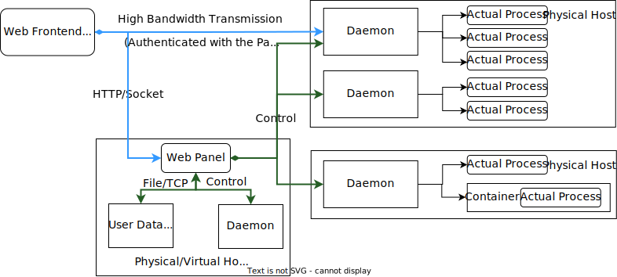

# Network Architecture

:::tip
If you want a proper reverse proxy, you have to first understand how MCSManager manages its network traffic. On this page, we briefly discussed the network principle of MCSManager. 
:::

Let's start with the daemons. MCSManager manages **multiple machines** together with a single `Panel`. The local/remote machines that were connected and managed is what we called `daemon`.

Suppose there are many users uploading files to different daemons, **if all files are transferred via the panel, the panel will become a bottleneck**, especially for remote daemons.

Therefore, we offload all operations that might require **a large bandwidth** directly to the daemon. Once authorized by the panel, the traffic (e.g. file uploading, console logs) will go ***directly*** from the browswer to the corresponding `daemon`. This will greatly reduce the load on the panel itself.

## Project Architecture

MCSManager has two parts: one **Panel** (Web Panel) and one **Daemon**.

**The Panel**

- User Management
- Connect to Daemon(s)
- Authentication for Most Operations
- API
- More...

**The Daemon**

- Process Management (Where Instances Run)
- Docker Image Management
- File Management
- Realtime Terminal Communication
- More...

## What Does This Mean?

This distributed architecture will make configuration for reverse proxy ***harder***. For most applications, we only need to configure a single port for reverse proxy. However, for MCSManager, at least ***two ports*** need to be configured: one for the **web panel** and one for the **daemon**. If you have more than one daemon, the reverse proxy for each daemon needs to be configured separately.

In addition, if you plan to support HTTPS with reverse proxy, you will have to configure HTTPS for all daemons. This is a hard requirement by the browser, otherwise, the browser will refuse to connect to daemons without HTTPS. 

## Theory

In general, the browser will need to be able to interact with the daemon directly to transfer files and console logs.

Consequently, the IP address for each daemon ***CAN NOT***  be a LAN address. In that case, the daemon status will stay at `Connecting`, and all users will not be able to access the panel from the public internet. 

