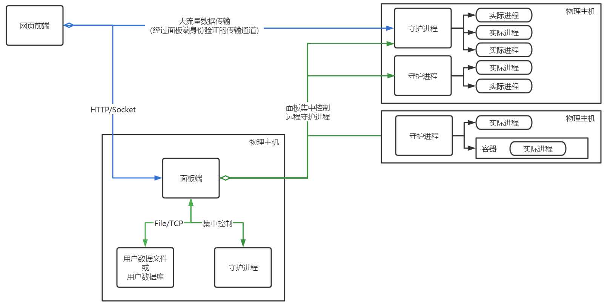

# 面板通信原理

首先我们知道 MCSManager 是支持将**多台机器**连接起来，由 `面板` 统一管理的，而被连接的本地主机或远程主机，我们称之为 `节点`。

那么如果有很多用户同时上传文件到不同的 `节点`，**如果所有上传文件的流量全部经过面板来转发，势必会造成宽带供不应求，甚至崩溃**。

为此，我们将所有**大流量**的操作，只让 `面板` 负责授权，由浏览器**直接连接** `节点` 传输数据（比如文件上传，控制台实时日志）等。如此一来，流量就平均分摊到各个节点，不会导致 `面板` 侧占满的情况。

## 这会影响到什么吗？

这会**严重加剧**反向代理或 HTTPS 配置难度。通常来说，配置反向代理只需要一个端口即可，但是由于 MCSManager 分布式的设计，你必须配置至少两个端口，如果你加入 HTTPS 配置，由于浏览器对于 HTTPS 网站的要求是所有连接必须全部是 HTTPS 协议，为此你需要为每一个远程节点全部配置并支持 HTTPS 才能成功。

## 原理图

右键新标签页打开可以放大。

